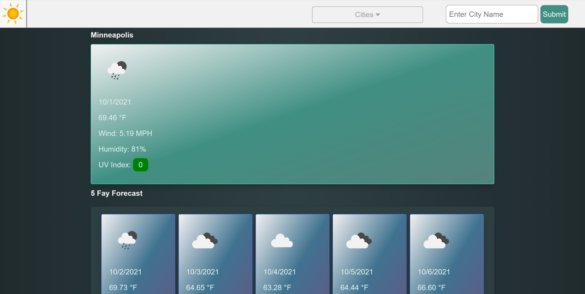

# Homework 6: Weather Dashboard

## Objective 

This webpage allows the user to search a city and receive weather data about that city.

## Changes

I created the HTML, JS, and CSS from scratch. I used JQuery and a CSS library for special icons (linked in HTML @ ln. 9). The idea is: You have a relatively bare-bones HTML doc that has a couple sets of cards and a nav. The nav allows you to search and add new cities, and the <em>cites drop-down menu</em>  uses ```localStorage``` to save the viewed locations. The rest of the code uses ```fetch``` to collect the API data, and JQuery is used to select HTML elements to fill with the gained data from ```fetch```.

## Code

This code snippet highlights how I added code to the HTML sections. ```getCardBodyHTML``` & ```getCardHTML``` functionally retrieve the html necessary to make cards appear on the screen (the former function being for a large card and the later is used for the 5-day-forecast cards). 
```JavaScript
function buildForecast(data, uvi) {

    // Clear cards
    $('#largeCard').empty();
    $('#fiveDay').empty();

    $('#largeCard').append(getCardBodyHTML( /* ... card data ... */ ));

    // Large card has UVI, small ones do not
    $('#largeCard').append(`<p>UV Index: <span class="uvi ${uviClass(uvi)}">${uvi}</span></p>`);

    // The rest of cards
    for (let i = 7; i < 40; i += 8) { // The api makes us step by 8 to get the different days in their forecast data
        $('#fiveDay').append(getCardHTML(/* ... card data ... */));
    }

    showData();

}
```
Here is some information on how I fetched data from the API. ```showData``` & ```hideData``` are used to show and hide cards when data is invalid or when page is starting up.
```JavaScript
fetch(queryURLForecast).then(response => {

    if (response.ok) {
        response.json().then(data => {

            buildForecast(/* Data from fetch */);

            // Update HTML h1 to location name
            $("#location").text(toTitleCase(cityName));

            // Add city data to local storage 
            addCity(cityName);
            
            });
        } else
            hideData();
    });
});
```

```toTitleCase``` makes the text <em>pretty</em>.

## Screenshots

Minneapolis Weather



5 Day Forecast


## Links

[Webpage](https://andrewtrudeau.github.io/06-weather-dashboard/)

[Github](https://github.com/andrewtrudeau/06-weather-dashboard)